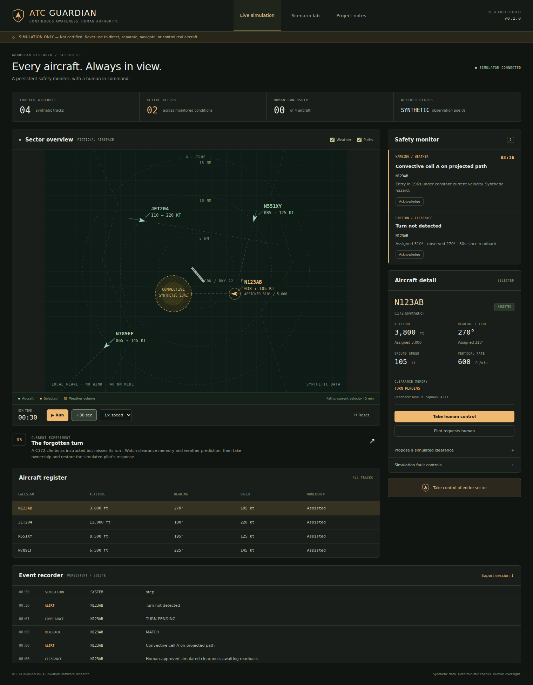
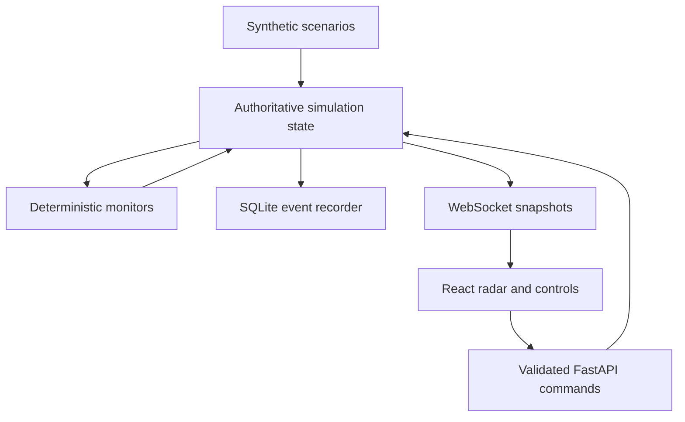

# ATC GUARDIAN

**Surveillance, Weather & Clearance Safety Monitor · v0.1.0**

A pilot-inspired aviation software research project exploring persistent clearance memory, explainable safety checks, and human supervision.

> **ATC GUARDIAN IS RESEARCH AND SIMULATION SOFTWARE.**
> It is not certified for air traffic control. It must not be used to direct, separate, navigate, or control real aircraft. Do not connect experimental builds to operational aviation infrastructure.



**Python / FastAPI · React / TypeScript · WebSockets · SQLite · pytest / Playwright**

## Start here

On Windows, install **Python 3.12** and **Node.js 22.12+** (Node 24 is used in CI). Extract the project, run `setup.cmd` once, then run `start.cmd`. Open **http://127.0.0.1:8000**. Initial installation needs internet; the installed simulator makes no external service calls and needs no API keys.

Full instructions: [Getting started](docs/GETTING_STARTED.md) · [First demo](docs/DEMO.md) · [Put it on GitHub](docs/GITHUB.md) · [Understand the code](docs/LEARNING_GUIDE.md).

## Problem

An instruction is not finished when it is spoken. It needs a correct readback, continued monitoring, and an explicit outcome. ATC Guardian explores how software could keep that lifecycle visible across multiple aircraft and changing conditions.

## Motivation and pilot perspective

The concept comes from Manny's experience as a private pilot in general aviation: maintaining attention to a smaller aircraft and remembering pending instructions matters even when a sector becomes busy. This is a learning and research project, not a validated claim about controller performance or a replacement for existing ATC systems.

Manny provides the project concept and pilot perspective. The initial implementation and documentation were developed with AI assistance. The learning guide is intended to support review, explanation, and further changes by the project owner.

## What runs today

| Capability | v0.1 behavior |
| --- | --- |
| Radar | Clickable synthetic tracks, altitude, speed, heading, trails, projected paths, weather layers |
| Clearance memory | Human-approved proposal, structured readback, compliance state, retained superseded clearance history |
| Missed turn | Configurable grace period; acknowledgement leaves the warning active |
| Altitude monitor | Distinguishes a normal climb from movement away, stalled progress, and deviation after reaching an altitude |
| Traffic | Continuous overlap of horizontal and vertical research volumes; horizontal CPA metrics |
| Weather | Three-dimensional synthetic cylinders; projected entry times and unavailable-data handling |
| Human supervision | Aircraft takeover, pilot human request, sector takeover, explicit restoration of assistance |
| Failure handling | Stale position suppresses prediction; interrupted feeds restrict assistance; browser disconnect disables commands |
| Events | SQLite records clearances, readbacks, state changes, alerts, acknowledgements, and takeovers; JSON export |
| Experiments | Five presets, pause/run, 1×/2×/4×, 30-second steps, reset into a new session |

**Not implemented:** an AI model, speech recognition, voice/radio transmission, real ADS-B, live weather, operational clearance generation, real-aircraft control, terrain, runway-incursion or wake checks, sensor fusion, emergency-code interpretation, complete incident replay, authentication, redundancy, or certification. See [ROADMAP.md](ROADMAP.md).

## System concept and safety philosophy

Deterministic software computes the research checks. The user reviews every proposed simulated clearance. AI interpretation is a future, non-authoritative layer. A lack of a modeled conflict is never presented as a declaration that a flight is safe.

Unknown data must stay visibly unknown. Human ownership persists after a fault is cleared, until the user explicitly restores assistance. Acknowledging an alert does not resolve its underlying condition.

## Architecture



Subsystems are deliberately kept in a small `backend` package for this release. Separate services, model processes, and adapter packages will only be introduced when they have working implementations. See [architecture/README.md](architecture/README.md) for units, boundaries, and ownership.

## Surveillance

The observation model uses a local east/north plane in nautical miles. It includes a synthetic callsign, type label, squawk, heading, altitude, groundspeed, vertical rate, and freshness. It is not an ADS-B decoder. No real ICAO identities, position-quality indicators, pressure-altitude conversions, or real geographic coordinates are claimed. In this no-wind simulation, true heading equals ground track. Real systems cannot assume that equality.

## Weather intelligence

Synthetic convective and icing zones have horizontal boundaries, altitude bands, and timestamps. The app reports projected intersection, not a certified avoidance route. When weather reaches its configured age limit, weather checks become unavailable. Interrupting the simulated feed immediately requests human ownership; the last observation remains visible until its age limit.

## Trajectory prediction

The display projects observed position at 30, 60, 120, and 300 seconds using constant current velocity. It does not model intent, wind, uncertainty, route constraints, or level-off. The separate proposal screener models a scripted turn and climb, assuming an immediate correct readback. Its assumptions are always shown.

## Conflict detection

Traffic monitoring finds times when horizontal distance is within a **3 NM illustrative volume** while vertical distance is within **1,000 ft**, over a **300 s** horizon. These are configurable research thresholds, not a representation of certified separation rules. The algorithm intersects time intervals instead of checking altitude only at horizontal closest approach. See [geometry notes](architecture/README.md#geometry).

## Clearance monitoring

An active clearance retains its target, issue time, readback state, acknowledgement time, and completion evidence. Superseding it copies the previous record into history. Reaching a target does not stop monitoring. The default missed-turn grace period is 30 seconds. Movement in an incorrect direction is not independently classified in this release; an unresolved turn eventually becomes overdue.

## Communications

Text readbacks use this deliberately narrow syntax:

```text
N123AB heading 310 altitude 5000
```

Unsupported text is unverified; a wrong identity or value is a mismatch. Both require human review. This is a structured parser, not aviation natural-language understanding. Issuing and reading back a clearance are separate actions. Nothing is transmitted over a radio.

## Human supervision and automation levels

`ASSISTED` means monitoring with simulated communication assistance; it does **not** mean autonomous ATC. `HUMAN` makes human communication ownership explicit. In both modes, the scripted pilot continues to fly. A pilot request immediately changes ownership. The first release does not automatically generate new clearances in either mode.

The long-term brief defines conceptual levels 0–4, from monitoring to advanced supervised sector automation. These are project ideas, not certification categories, and are not implemented as an autonomy selector in v0.1. No higher authority is granted when a component fails.

## Cybersecurity

The launcher binds only to `127.0.0.1`. API inputs are bounded; unknown fields are rejected; browser origins and hostnames are checked. There are no credentials or external data adapters. Events are inspectable, **not tamper-proof**. This is a single-user prototype with no authentication, rate limiting, or hardened deployment boundary; do not expose it on a public network. More details: [SECURITY.md](SECURITY.md).

## Failure modes

Stale surveillance, interrupted weather, mismatched readbacks, missing browser updates, and a simulation-clock fault have explicit handling. Restoration of a feed does not automatically restore assistance. For stale observations, a previously detected condition is logged as **WITHHELD**, not resolved. Disk failures, adversarial feeds, spoofing, redundancy, and full sensor validation remain open work. See [hazard register](docs/HAZARDS.md) and [test scope](docs/TESTING.md).

## Testing

From the project folder after setup:

```powershell
.\.venv\Scripts\python.exe -m pytest
cd frontend
npm run build
npx playwright install chromium
npm run test:e2e
```

For browser tests, keep `start.cmd` running, or activate the Python virtual environment first so the test runner can launch the backend. The supplied GitHub Actions workflow runs Python checks, the frontend build, and browser tests on Linux and Windows after you push the repository. A workflow file is not evidence of a completed CI run; see [verification results](docs/TESTING.md).

## Screenshots

The image above is captured from the running application. The sector, weather, runway, and aircraft are fictional. UI screenshots are stored in `screenshots/`.

## Installation and development

Windows: `setup.cmd`, then `start.cmd`. macOS/Linux: `bash setup.sh`, then `.venv/bin/python run.py`.

For hot reload, run FastAPI on port 8000 and `npm run dev` inside `frontend` on port 5173. The Vite proxy forwards API/WebSocket traffic. Keep a single backend worker because one process owns the simulation. See [GETTING_STARTED.md](docs/GETTING_STARTED.md).

## Roadmap and future research

Start by reproducing and explaining the five included experiments. Then add recorded replay, surveillance schemas, terrain/weather uncertainty, carefully constrained text interpretation, and controller-reviewed voice simulation in separately tested releases. The full concept is preserved in [PROJECT_VISION.txt](docs/PROJECT_VISION.txt); it describes future goals, not completed features. [ROADMAP.md](ROADMAP.md) specifies the next milestones.

## Limitations

This prototype can miss hazards and produce nuisance alerts. The small planar geometry, static weather, generic motion limits, fixed thresholds, narrow readback syntax, and unvalidated human-factors design cannot support real aircraft operations. It has not been evaluated by air traffic controllers, regulators, or aviation assurance specialists. Passing its tests is not evidence of operational safety.

## Research sources

FAA material informed the project's distinctions between advisory weather and tactical use, minimum fuel and emergencies, airborne avoidance instructions, and airborne versus ground-system assurance. Those references and the questions they leave open are recorded in [SAFETY.md](docs/SAFETY.md). This project claims no FAA, RTCA, SAE, or other approval.

## License

MIT. See [LICENSE](LICENSE). The research-use notice describes the project's intended use and limitations; it is not a certification or additional MIT license condition.
