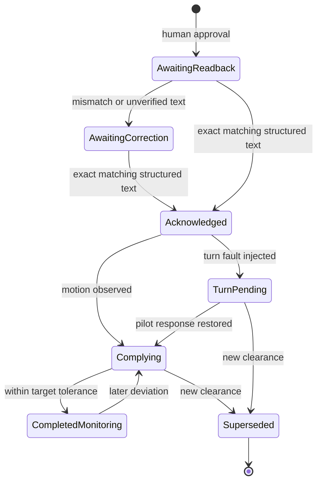

# Architecture and units

## Boundaries

| Module | Responsibility | Why it is separate |
| --- | --- | --- |
| `backend/models.py` | Aircraft, clearance, weather, settings, validated command schemas | Makes observed values and assigned values distinct |
| `backend/geometry.py` | Prediction and volume intersection | Pure calculations can be tested independently of UI and time |
| `backend/monitor.py` | Turns observations into explainable alerts | Detection has no command authority |
| `backend/engine.py` | Simulation time, scripted pilot behavior, clearance lifecycle, ownership, alert transitions | One authoritative state owner |
| `backend/recorder.py` | SQLite sessions and events | Retains an inspectable history across scenario resets |
| `backend/app.py` | Local HTTP commands, WebSocket state, clock, static UI | Browser input is validated before it reaches the engine |
| `frontend/src/main.tsx` | Radar, scenario navigation, aircraft detail, controls | A presentation layer, not the safety engine |
| `scenarios/` | Trusted synthetic JSON fixtures | Experiments are reviewable and easy to reproduce |

The engine and monitor are logically separate, not isolated processes. Fault containment, redundant engines, multi-user coordination, and watchdog independence are not established. FastAPI handlers run on one event loop without awaits inside mutations. Use exactly one backend worker. Multiple browser tabs share the same simulation and have no separate authorization roles.

## Coordinate and time conventions

| Value | Meaning |
| --- | --- |
| x / y | East / north in NM from an arbitrary fictional origin |
| heading | True degrees clockwise from north; no magnetic variation |
| ground track | Equal to heading only because wind is absent |
| speed | Groundspeed in knots, converted to NM/second |
| altitude | Synthetic feet on one common datum; not pressure/geometric/MSL interchangeability |
| vertical rate | Feet/minute; positive upward |
| simulation time | Seconds since preset load; pausing freezes freshness and movement |
| recording time | Actual UTC timestamp of the event write |

The clock advances a fixed fraction of simulated time per callback. CPU delay slows the simulation rather than jumping forward. Speed changes preserve checks at no more than one simulated second per step. A scenario stops after 1,800 seconds. The screen is a fixed fictional sector; aircraft may leave its bounds and remain in the register.

## Geometry

For speed `s` in knots and true heading `h`:

`vx = sin(h) × s / 3600`, `vy = cos(h) × s / 3600`.

The future observation is `p(t) = p(0) + v × t`. This is a local planar approximation, not a geodesic calculation. Constant vertical-rate prediction can project through an assigned altitude; intent-aware prediction is future work.

For relative horizontal position `r` and velocity `v`, horizontal CPA time is the bounded value of `-dot(r,v) / dot(v,v)`. Zero relative speed is handled explicitly.

Traffic risk is **not** determined solely at that time. We solve `|r+v×t|² <= R²` for its time interval and intersect it with `|z+vz×t| <= H` over the horizon. This captures a later vertical convergence while aircraft remain horizontally close. Threshold boundaries and tangencies are included conservatively.

Weather checks intersect a horizontal disk interval with a vertical slab interval. Weather is static, circular, and synthetic. The geometry says nothing about actual storm avoidance margins, growth, uncertainty, radar age, or aircraft capabilities.

Proposal screening applies the generic scripted turn/climb model in one-second segments, checking each segment as a swept interval. It assumes immediate readback and perfect compliance; it is conditional screening, not validated conflict resolution. All new proposals are screened again when approved. Missing observations block approval. A human may approve a simulated experiment with findings, and that decision is recorded.

## Clearance lifecycle

Any active clearance can be superseded, including one waiting for readback or one already completed. Previous state remains in aircraft history and the event recorder. Cancel/reject commands and a general instruction queue are not implemented. The current clearance has one heading and one altitude; speed, runway, route, frequency, and conditional clearances are future fields.

## Freshness and authority

At 10 seconds without a position update, the aircraft's last observation remains visible but its prediction and compliance assessment are withheld. Traffic pairs involving it are no longer assessed. At 120 seconds of weather age, weather assessment is unavailable. Source interruption immediately requests human ownership even before the age limit; restoration refreshes the synthetic observation but never restores assistance automatically.

An unavailable source removing a previous hazard result records `WITHHELD`, not `RESOLVED`. The remaining data alert explains why. Acknowledgement suppresses no calculation and changes no ownership. `HUMAN` means simulated communications belong to the person; it does not halt the scripted pilot.

## Persistence and replay boundary

SQLite stores every important event generated by this implementation, including initial scenario data and configuration. The UI shows the newest 45 events; export includes the complete current-session event list and final snapshot. Motion samples are **not** continuously stored, so this is not incident replay or crash recovery. Historical sessions remain in SQLite but there is no historical-session browser yet. Replaying arbitrary sequences exactly requires the next release's input/tick recording design.

## Planned adapters

Future surveillance and weather adapters need source identity, observation/receipt times, units, coordinate reference, quality flags, and explicit validity. Multiple sources must not silently overwrite one another. AI output must be untrusted proposed structured data with provenance and bounded permissions. No adapter, model host, external API connection, or radio output is present in this release.
